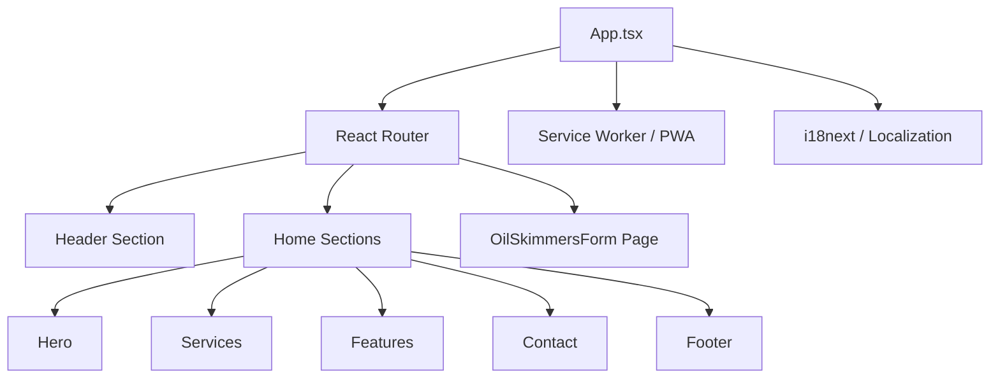
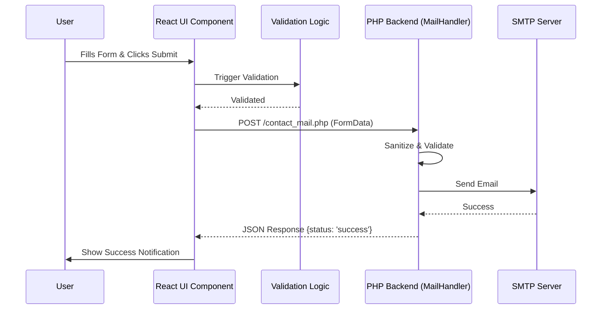

# PIIC Portal Architecture

This document describes the high-level architecture and data flow of the PIIC (Portal Industrial, Tecnológico y Comercial) application.

## 🏗️ High-Level Component Structure

The application follows a modern React architecture with a focus on component modularity and responsiveness.

## 🔄 Contact Form Data Flow

## 📋 Technology Stack

- **Frontend**: React 18 (Vite)
- **Styling**: Vanilla CSS (Tailwind and Custom Tokens)
- **Testing**: Vitest + Testing Library (~100% Coverage)
- **Infrastructure**: Progressive Web App (PWA) + Google Workload
- **Backend**: Lightweight PHP Mailer with Rate Limiting
- **QA**: Storybook for Component Documentation

## 🛡️ Security Measures

1. **Rate Limiting**: Backend protection against spam.
2. **Form Sanitization**: Input cleaning to prevent injection.
3. **PWA Offline Support**: Service worker for resilient operation.
4. **CSRF Protection**: Domain-locked API handlers.
