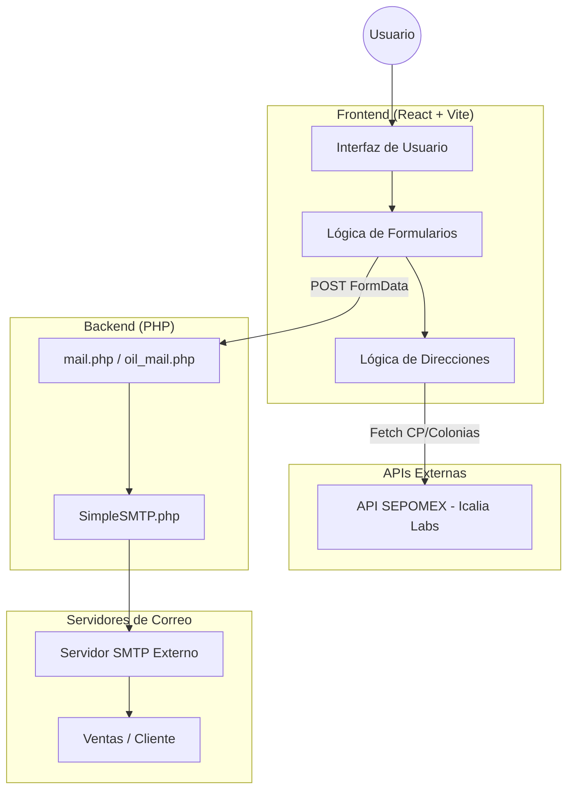

# Arquitectura del Proyecto - PIIC Portal

Este documento describe la arquitectura técnica, el flujo de datos y las decisiones de diseño del portal de PIIC.

## Diagrama de Arquitectura

El portal utiliza una arquitectura híbrida con un frontend moderno en React y un backend ligero en PHP para el procesamiento de formularios y envío de correos.

## Decisiones de Diseño Clave

### 1. Estrategia "Zero-Weight" (Branding)
Para maximizar la compatibilidad y velocidad de carga, especialmente en correos electrónicos, se evitó el uso de imágenes pesadas para el branding.
- **Logo**: Implementado mediante **CSS** y **VML** (para compatibilidad con Outlook), garantizando nitidez total en cualquier resolución sin peso de descarga.
- **Iconografía**: Uso de formas geométricas CSS para evitar peticiones HTTP adicionales.

### 2. Lógica de Direcciones (México)
El formulario técnico de Oil Skimmers integra una validación de dos capas:
- **Estática**: `mexico.json` contiene la relación Estado-Municipio para una carga instantánea.
- **Dinámica**: Integración con la API de **SEPOMEX** para obtener colonias y códigos postales en tiempo real según el municipio seleccionado.

### 3. Seguridad y Entrega de Emails
- **Backend PHP**: Procesa de forma segura los archivos adjuntos (memorias técnicas) y los transmite al servidor SMTP.
- **SimpleSMTP**: Clase personalizada para manejar la comunicación con el servidor de correo vía Sockets, evitando dependencias pesadas como PHPMailer.

## Estructura de Directorios

- `/src`: Código fuente de la aplicación React (TypeScript).
- `/public`: Activos estáticos y scripts de backend PHP.
- `/docs`: Documentación técnica y diagramas.
- `/tools`: Herramientas internas de desarrollo y pruebas (no destinadas a producción).

---
© 2026 PIIC - Proyectos Integrales de Ingeniería y Control.
